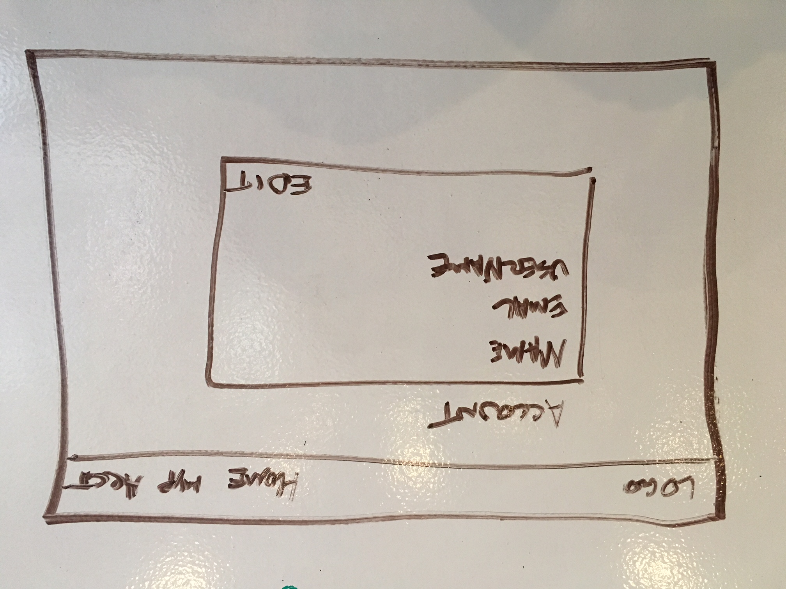

# Wilderness Passport

### Purpose

Wilderness Passport is a full CRUD web application, designed to allow users to get the most out of their favorite National Parks. Users will be able to find parks near them, add their "stamps" to their passport, and see news, alerts, and articles about their favorite parks. In Phase 2, a user will be able to plan a trip to a park, and other users will be able to search for users near them who are planning trips.

WP will make use of the MVC pattern, running on an Express back end server. The app will be initially deployed to Heroku.

### Wireframes

### Initial Thoughts

At its core, the app will make use of the MVC pattern, and have authentication, with salted, hashed passwords. It will also make use of the Google Geolocation API, and the National Park Service Data API.

The NPS API is rather limited in search functionality, so I will probably need to make a parks database of all the park codes along with their names and locations to allow search functionality by park name.

### User Stories

From the user's perspective on first signing up, they will be able to search for parks either by name or by ZIP code. Upon finding a park they like, they will be able to add that park to their passport, selecting whether they want to visit or they have already visited.

Once a user has at least one park in their passport, they will have a new page, which has articles, alerts, and events pertaining to all the parks in their passport. 

They will also be able to edit their passport parks to indicate whether they've visited or not, and add new parks that they've visited or are interested in.

In further phases, users will be able to plan trips to parks in their passport. Afterward, other users will be able to find users' trips near them.

### Phases of Completion

#### Phase -3
- Create basic Express server app, with passport MVC
- Implement parks database

#### Phase -2
- Implement authentication
- Basic Styling
- Main view

#### Phase -1
- Account page
- Individual Park views
- Park search

#### Phase 0
- Final styling
- Deployment

#### Phase 1
- Trip planning functionality

#### Phase 2
- Nearby trip search
